# Hello Welcome to My work

Here I'm doing my work for Coursera EDA course.   
So see some of my works here.

# Plots
Nessessory data sets and R codes are provided. :)   
Codes for some plots, you will see when you do swirl work.

### Plot 1

     

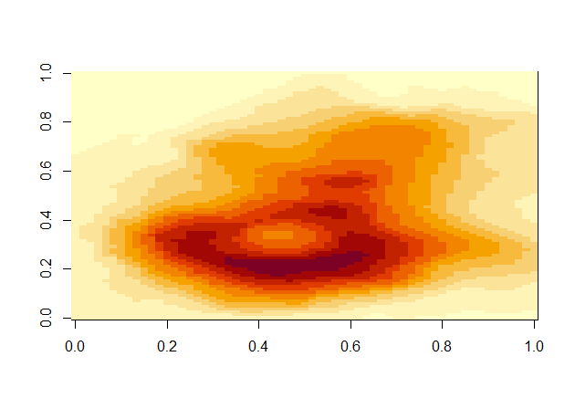    

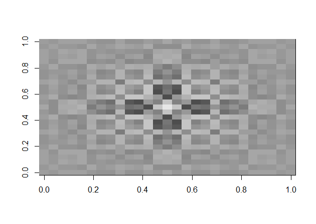    

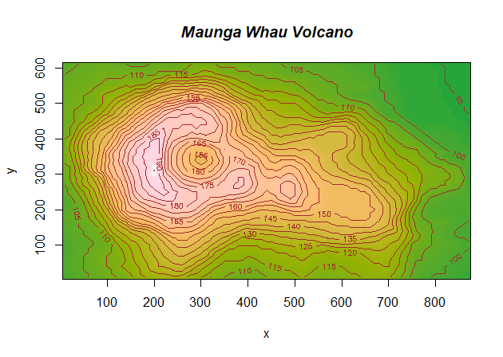    

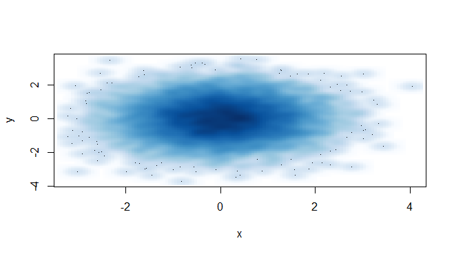

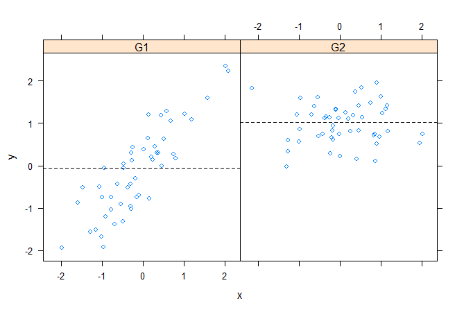  

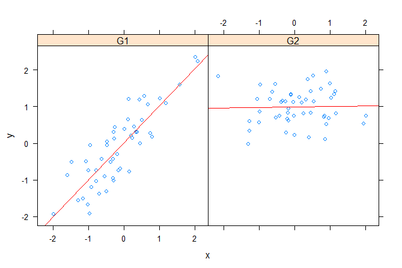    

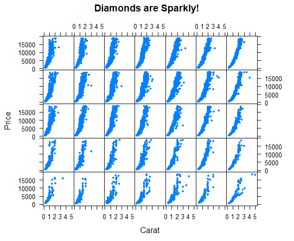 

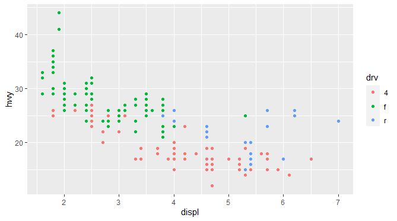   

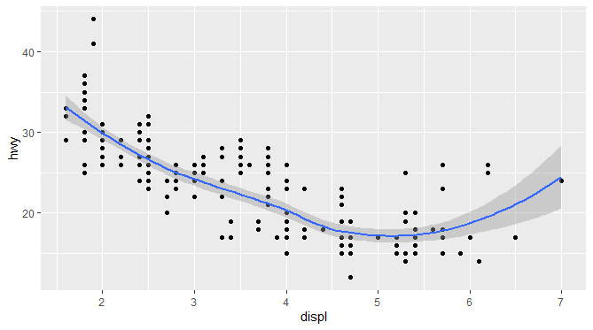   

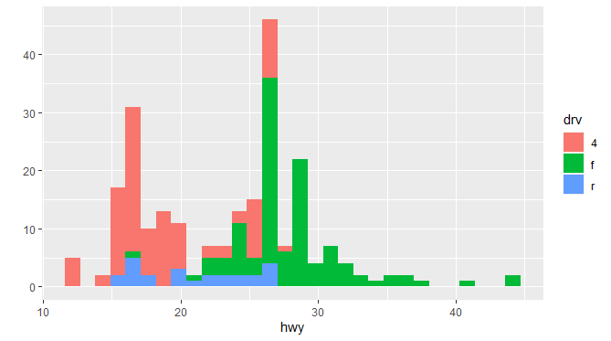   

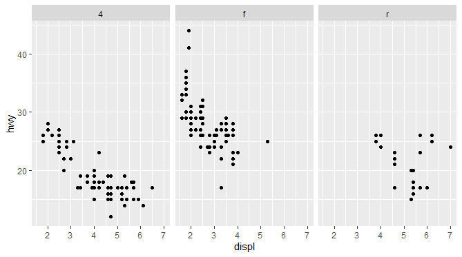    

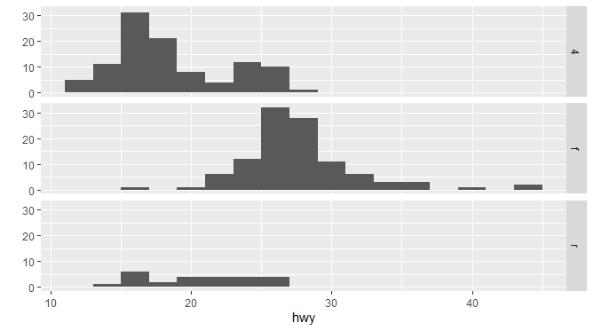   

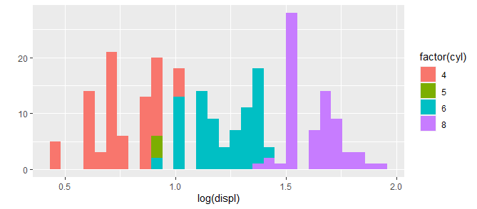   

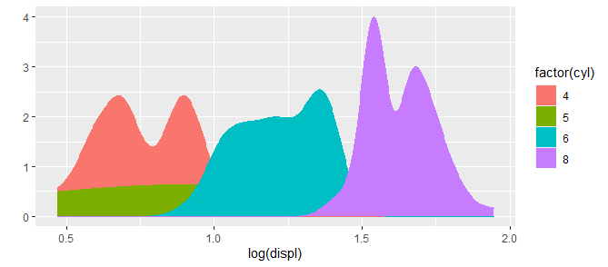    

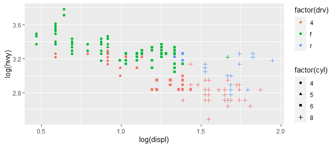    

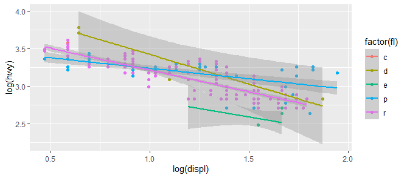   

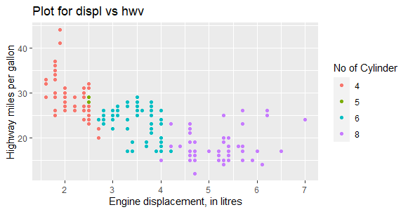   

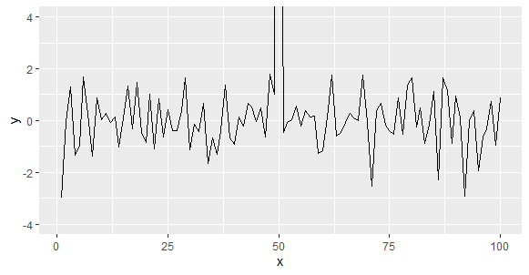   

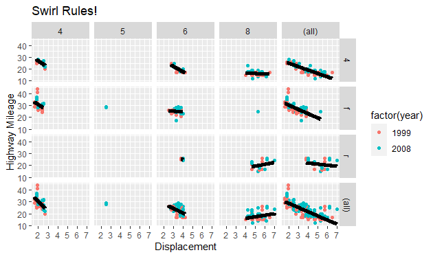    

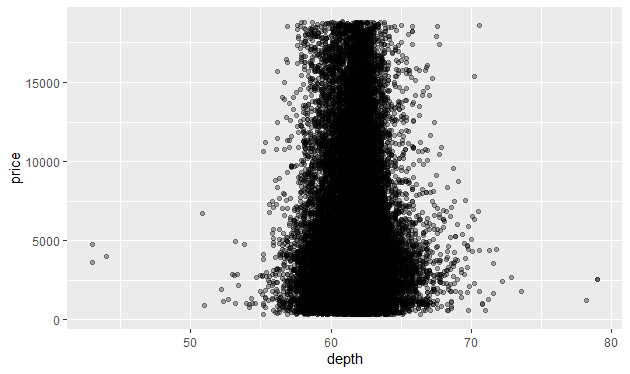    

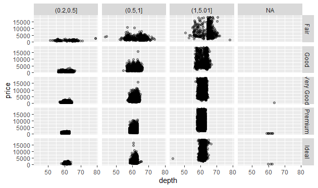   

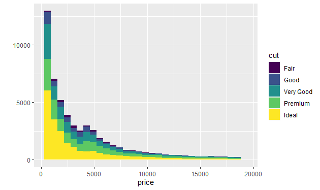   

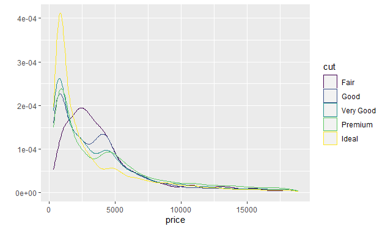    

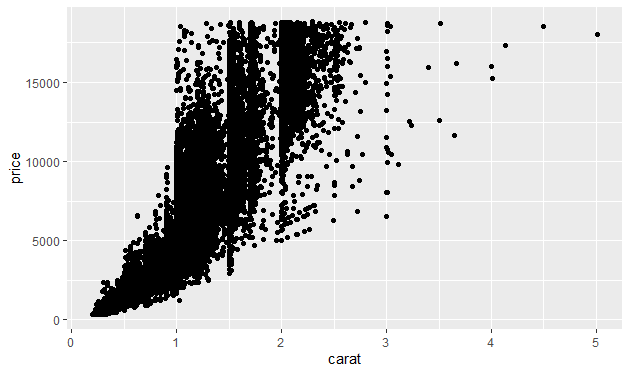    

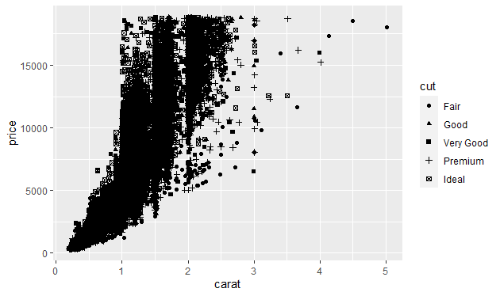    

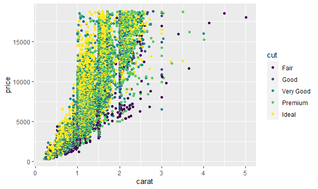    

   

Thank You!!!  

Me : Pruthuvi Kehelbedda(UOP)