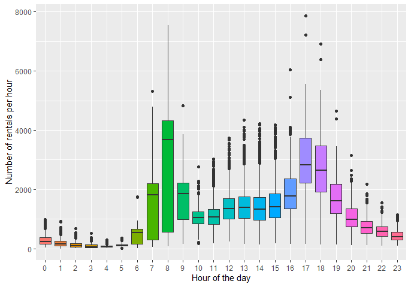
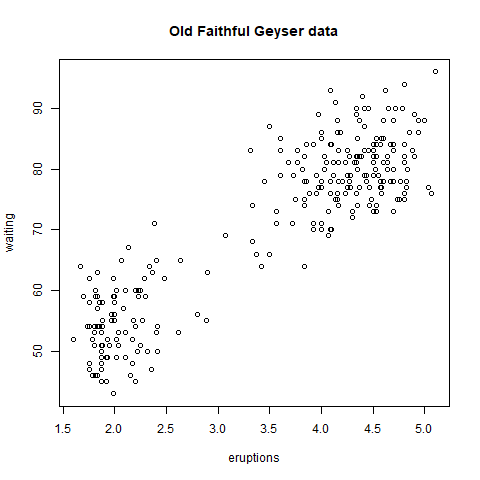

# Hello Welcome to My work

Here I'm doing my work for Coursera EDA course.   
So see some of my works here.

# Plots
Nessessory data sets and R codes are provided. :)

### Plot 1

    

   

 

 

  

    

   

     

   

 

Thank You!!!  

Me : Pruthuvi Kehelbedda(UOP)